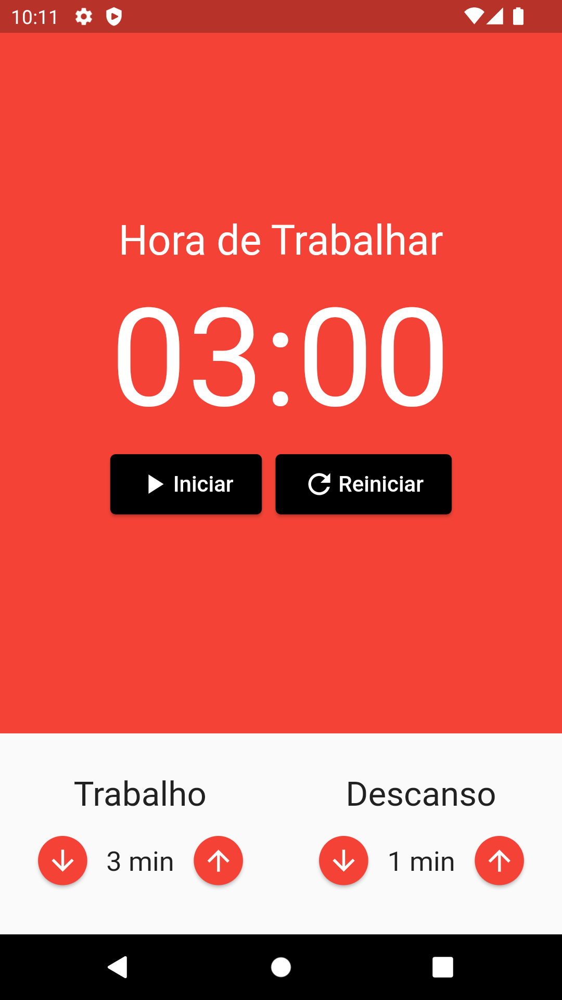
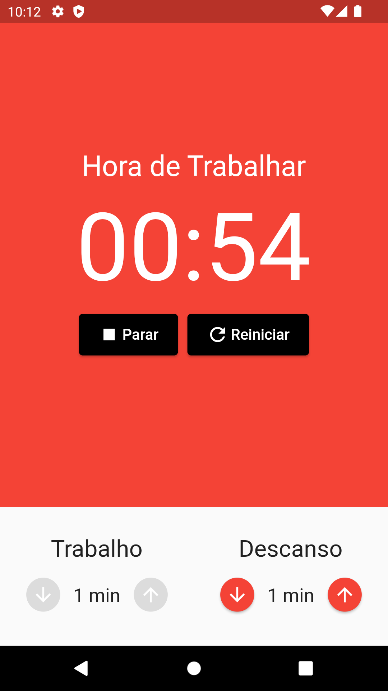
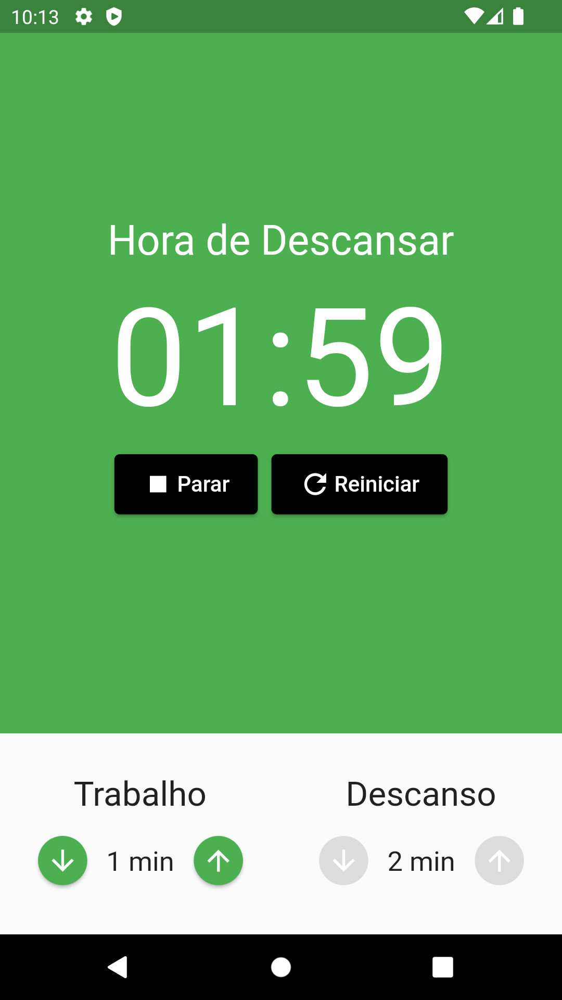
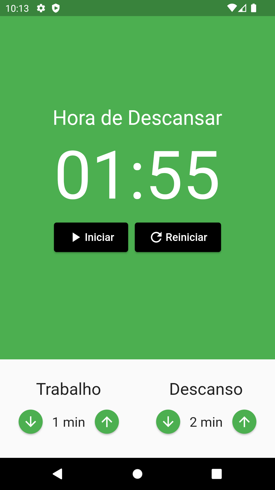

# Flutter Pomodoro

### Projeto flutter criado para praticar lógica utilizando Mobx

 Funções como incrementar e decrementar tempo relacionado a descanso e hora de trabalhar, incluindo mudança de cor para auxiliar na diferença visual de ambos, e controle de valores negativos para os timers. 
